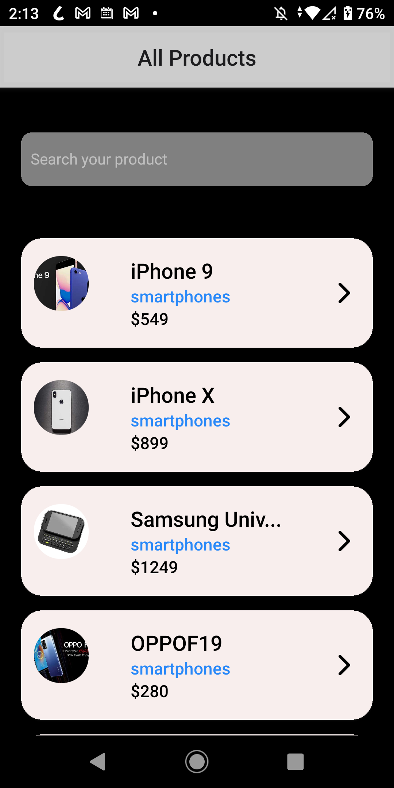
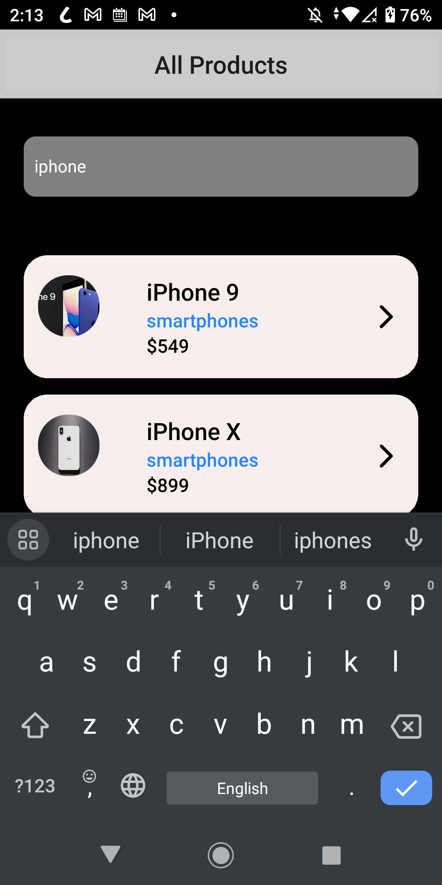
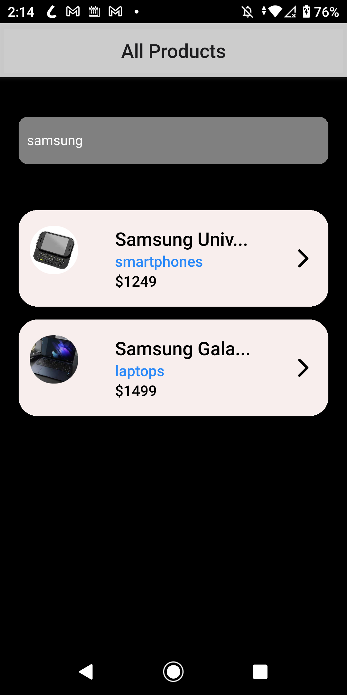
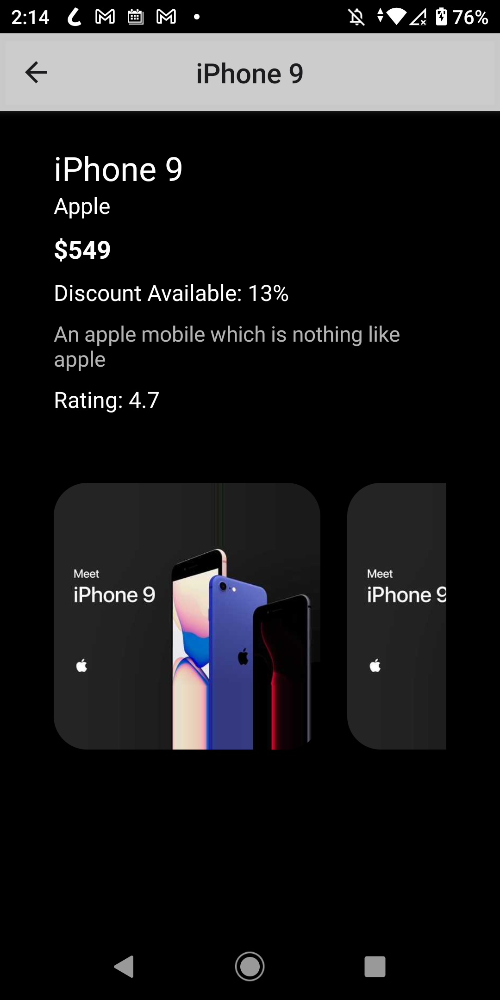

# Ramailo-Product-Demo-App

An demonstration app developed using React Native CLI for Android.

# Table of Contents

- [App functions](#app-functions)
- [Editor Setup](#editor-setup)
- [Install dependencies](#install-dependencies)
- [Start react native metro bundler](#start-react-native-metro-bundler)
- [Build the app on android](#build-the-app-on-android)
- [App Screenshots](#app-screenshots)

# App Functions

A user is able to:

- View the products
- Learn further details about the product
- Browse the product pictures

# Editor Setup

```
- Prettier
- ESLint
```

#  Install dependencies

```bash
npm install
```

#  Start react native metro bundler

```bash
npx react-native start || npm start
```

#  Build the app on android

```bash
npx react-native run-android || npm run android
```

If everything is set up _correctly_, you should see your new app running in your _Android Emulator_ .

# App Screenshots





